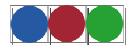
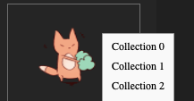
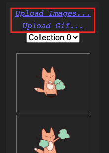
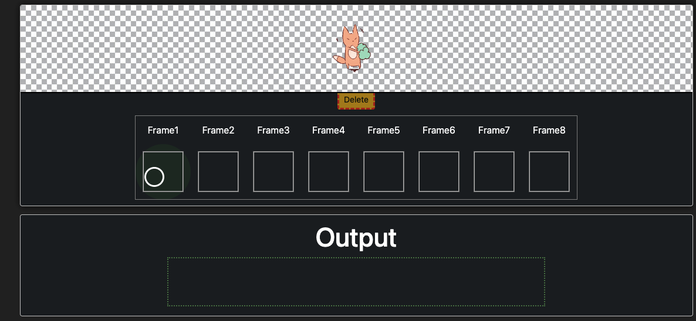
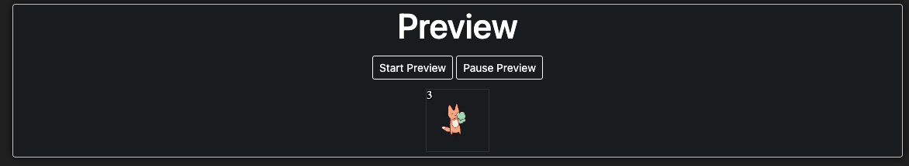
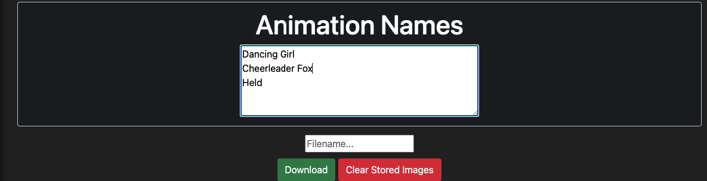

# Fruity Dance Sprite Sheet Generator

    <h3> A generator for the Fruity Dance plugin</h3> 
  

This generator was specifically made with the FL studio plugin known as [Fruity Dance](https://www.image-line.com/fl-studio-learning/fl-studio-online-manual/html/plugins/Fruity%20Dance.htm) in mind. You don't have to change the height and width of the sprite sheet manually, as this generator does all that automatically.

## The Plugin Rules
The rules can be sumarized as such:
1. All cells must be equal in width and height, and there must be 8 of them for every row. Say we want a image that is 300px wide: we would need to devide it by eight (300 / 8 = 37.5) and thus we get the width of every cell. The same goes for the height. It does not matter if the height and the width is not the same, as long all cells have equal poppritons. 
2. There must be a `.txt` file with the exact same name as the image file (e.g. generated.png & generated.txt). Every animation name is devided by a **new line** and the last animation name must always be "Held".
3. Altough not mentioned by the website, the animation goes from left to right in a loop. (1 -> 8 -> 1 -> 8, etc.)

## Using the generator
Simply clone the project and open the `index.html` file inside the `generator` folder to get started. The only thing you need is a modern browser to run it. 

## Feautures
* Right click on an image to sort it into a "collection".   

* Upload images or a gif to auto extract its frames (max 10mb).  

* Edit a cell by clicking on it. You can change the offset or delete the image. You can also edit the row amount and cell size of the entire sprite sheet.  

* Drag and drop images into the grid to place them! You can also delete a uploaded image by dragging it to the delete button. A circle will show you where your mouse is, and the preview will show you the image.  

* Watch your sprite sheet live with the preview section.  

* Edit the name of animations and the ZIP!

 
### Libaries
* bootstrap - MIT -  Copyright (c) 2011-2018 Twitter, Inc / Copyright (c) 2011-2018 The Bootstrap Authors - https://github.com/twbs/bootstrap
* CtxMenu-Javascript - MIT - Copyright (c) 2019 Nils Söderman - https://github.com/nils-soderman/CtxMenu-Javascript
* ElementCatcher - MIT - Copyright (c) 2022 TheWilley - https://github.com/TheWilley/ElementCatcher
* FileSaver.js - MIT - Copyright (c) 2016 Eli Grey - https://github.com/eligrey/FileSaver.js
* gif-frames - MIT - Copyright (c) 2017 Ben Wiley - https://github.com/benwiley4000/gif-frames
* interact.js - MIT - Copyright (c) 2012-present Taye Adeyemi - https://github.com/taye/interact.js
* Jquery - MIT - Copyright (c) 2015 The jQuery Foundation - https://github.com/jquery/jquery
* JSZip - MIT - Copyright (c) 2009-2016 Stuart Knightley, David Duponchel, Franz Buchinger, António Afonso - https://github.com/Stuk/jszip

## Issues
Plase create a new issue if you find a bug or a missing feature. Thanks.
